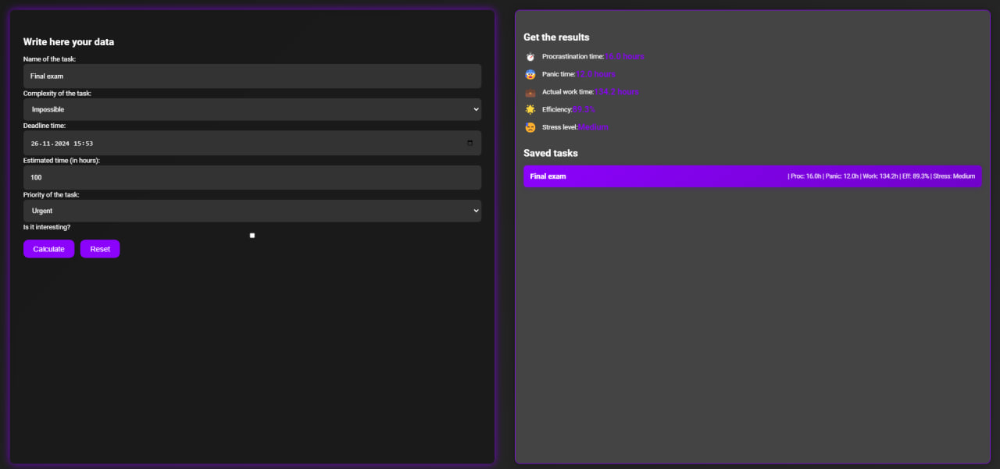

# Procrastination Calculator 🎯

A smart calculator that helps you understand your work patterns and manage procrastination effectively. This tool analyzes task parameters and provides insights about your work efficiency and time management.

## ✨ Features

### Input Analysis

- Task name tracking
- Complexity level assessment (Easy/Medium/Hard/Impossible)
- Deadline management with datetime picker
- Estimated time calculation
- Priority level assignment
- Interest level indication

### Results Dashboard

- Procrastination time calculation
- Panic time estimation
- Actual work time projection
- Work efficiency percentage
- Stress level indicator

### Task History

- Saved tasks tracking
- Performance metrics visualization
- Historical data analysis



## 🛠️ Technologies

- TypeScript
- SCSS
- HTML5
- Modern JavaScript (ES6+)

## 📦 Project Structure

src/
├── calculator.ts # Main calculator logic
├── calculator.js # Compiled JavaScript
├── index.html # Main HTML structure
├── main.ts # Entry point
├── types.ts # TypeScript type definitions
└── styles/
├── style.css # Compiled styles
└── style.scss # SCSS source

## 🚀 Getting Started

### Prerequisites

- Node.js (>= 14.0.0)
- npm (>= 6.0.0)

### Installation

1. Clone the repository

```bash
git clone https://github.com/mtnlmptnss/Procrastination-calculator.git
```

1.  Install dependencies

-npm install

1.  Start development server

-npm run dev
💡 How It Works
The calculator takes several factors into account:

Task Complexity

Easy: Simple, straightforward tasks
Medium: Requires some effort and focus
Hard: Complex tasks requiring significant effort
Impossible: Extremely challenging tasks

Time Management

Deadline timing
Estimated completion time
Priority level

Personal Factors

Interest level
Task urgency

Based on these inputs, it calculates:

Procrastination time
Panic time window
Actual work time needed
Overall efficiency
Expected stress level

🤝 Contributing
Pull requests are welcome. For major changes, please open an issue first to discuss what you would like to change.
📝 License
MIT
